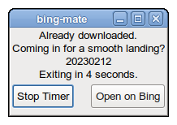

# bing-mate

Small program to get the current bing "today in bing" image and set it as wallpaper on mate-desktop.
Badly written because I reused my first GTK-3 program as a base (that's why you can see some browser references), if you see any problem with licensing, leaks (there are many) or bugs just make a PR or issue. 

# Build
## openSUSE
`# zypper install make gtk3-devel libcurl-devel libjson-c-devel`

## Debian
`# apt install build-essential libgtk-3-dev libcurl-dev libjson-c-dev`

# Running
`make run`

# Materiais
- https://www.treinaweb.com.br/blog/criando-interfaces-graficas-no-c-com-gtk
- https://zetcode.com/gui/gtk2/menusandtoolbars/
- https://specifications.freedesktop.org/icon-naming-spec/icon-naming-spec-latest.html
- https://curl.se/libcurl/c/getinmemory.html
- https://docs.gtk.org/gtk3/